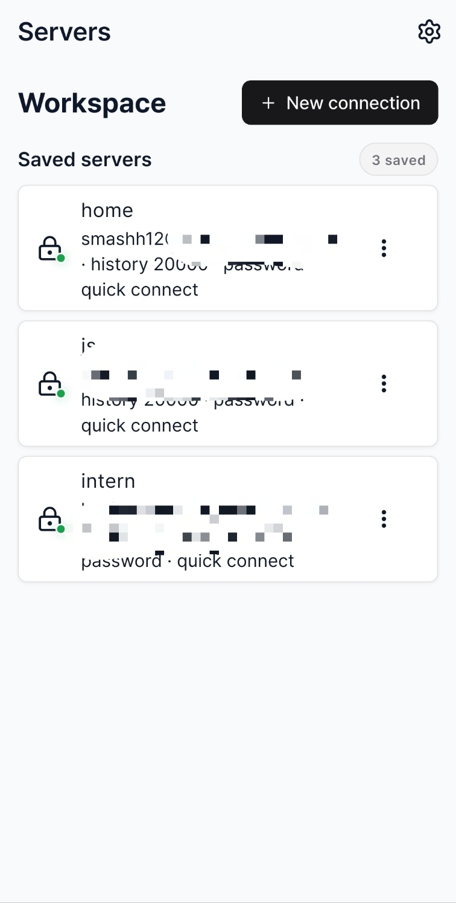
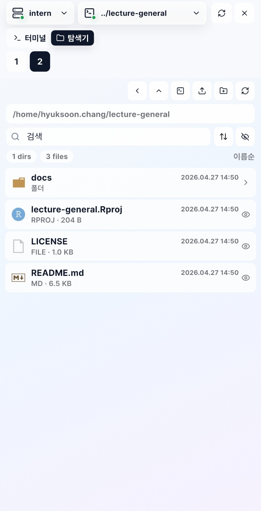
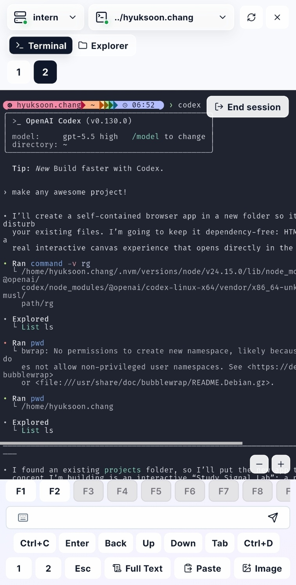

<p align="center">
  
</p>

# SEIL: AI Agent Tmux Workspace

휴대폰에서 AI 에이전트 워크플로를 관리하는 모바일 멀티 세션 tmux 앱입니다.

[English](README.md) | [한국어](README.ko.md) | [日本語](README.ja.md) | [中文](README.zh.md)

## 스크린샷

<p align="center">
  <kbd></kbd>
  <kbd></kbd>
  <kbd></kbd>
</p>

SEIL은 휴대폰이나 태블릿에서 SSH 워크스페이스, 원격 tmux 세션, SFTP 파일을 관리하기 위한 Flutter 모바일 앱입니다. 원격 서버에서 AI 에이전트, 코딩 어시스턴트, 장시간 실행되는 터미널 작업을 운영하는 개발자가 세션에 다시 접속하고 상태를 확인하며 제어할 수 있도록 설계되었습니다.

### 주요 기능

- SSH 연결 템플릿을 로컬에 저장합니다.
- 비밀번호 또는 private key 인증으로 접속합니다.
- 연결 secret을 플랫폼 secure storage에 저장합니다.
- 여러 SSH 워크스페이스를 동시에 관리합니다.
- 원격 tmux 세션을 탐색, 선택, 생성, 종료합니다.
- tmux pane, window, 스크롤, 명령 입력을 위한 터미널 컨트롤을 제공합니다.
- SFTP로 원격 파일을 탐색합니다.
- 폴더 생성, 파일 이름 변경, 업로드/다운로드, 텍스트 파일 읽기/쓰기를 지원합니다.
- 로컬 앱 bootstrap, 로그인, 비밀번호 변경 흐름을 제공합니다.

원격 tmux 기능을 사용하려면 대상 서버에 `tmux`가 설치되어 있어야 합니다. SSH와 SFTP 기능을 사용하려면 대상 서버가 SSH 접속을 허용해야 합니다.

### 프로젝트 구조

이 저장소는 일반적인 Flutter 프로젝트 구조를 따릅니다.

```text
lib/        Flutter 애플리케이션 소스
android/    Android 플랫폼 프로젝트
linux/      Linux 데스크톱 플랫폼 프로젝트
web/        Web 플랫폼 파일
assets/     이미지, 폰트, 파일 아이콘
scripts/    개발 보조 스크립트
test/       Flutter 테스트
```

### Flutter 빌드 환경

빌드 전에 일반적인 Flutter 개발 환경을 설치합니다.

- Flutter SDK, Dart 포함
- Android Studio
- Android SDK Platform Tools
- Android SDK Command-line Tools
- Android 에뮬레이터 또는 실제 Android 기기
- 이 Flutter 프로젝트에 포함된 Android Gradle Plugin과 호환되는 Java/JDK

환경을 확인합니다.

```bash
flutter doctor -v
flutter doctor --android-licenses
flutter devices
```

### 설치

```bash
git clone https://github.com/zarathucorp/seil-flutter.git
cd seil-flutter
flutter pub get
```

### 디버그 모드 실행

연결된 Android 기기 또는 에뮬레이터에서 실행합니다.

```bash
flutter run
```

특정 기기를 선택할 수도 있습니다.

```bash
flutter devices
flutter run -d <device-id>
```

Android 에뮬레이터 개발용 보조 스크립트도 포함되어 있습니다.

```bash
./scripts/dev-android-emulator.sh
```

필요하면 환경 변수로 동작을 조절할 수 있습니다.

```bash
AVD_NAME=Pixel_10 EMULATOR_MEMORY_MB=4096 ./scripts/dev-android-emulator.sh
CLEAN_BEFORE_RUN=1 ./scripts/dev-android-emulator.sh
```

### APK 빌드

release APK를 빌드합니다.

```bash
flutter build apk --release
```

생성된 APK는 일반적으로 아래 경로에 있습니다.

```text
build/app/outputs/flutter-apk/app-release.apk
```

### APK 설치 및 실행

Flutter로 설치합니다.

```bash
flutter install -d <device-id>
```

또는 `adb`로 빌드된 APK를 설치합니다.

```bash
adb install -r build/app/outputs/flutter-apk/app-release.apk
```

설치 후 Android 런처에서 SEIL을 실행합니다.

### 유용한 명령

```bash
flutter clean
flutter pub get
flutter test
flutter analyze
flutter build apk --debug
flutter build apk --release
```

### 라이선스

이 저장소의 소스 코드는 Apache License 2.0에 따라 라이선스가 부여됩니다. Zarathu의 이름, 로고, 상표는 합리적인 출처 표시를 위해 필요한 경우를 제외하고 소스 코드 라이선스에 포함되지 않습니다.
